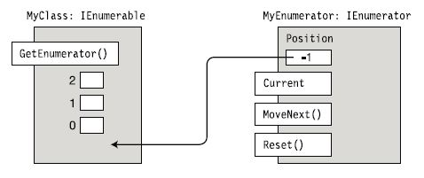

# Iterator Pattern in C#

---

## Collections

----

### Was ist eine Collection?

- Funktionen mit unterschiedlichen Graden
- Hinzufügen von Elementen unterstützen (optional)
- Entfernen von Elementen unterstützen (optional)
- Indizierung von Elementen unterstützen (optional)
- Entfernen von allen Elementen (optional)
- **Möglichkeit zur Aufzählung der einzelnen Elemente unterstützen** <!-- .element: class="fragment" -->

---

## Aufzählung

.Net bietet für alle Sammlungen einen Aufzählmechanismus

```csharp[|3-6|]
List<int> nums = new List<int> { 2, 3, 7, 5, 8, 12, 18 };

foreach (int num in nums)
{
    Console.WriteLine(num);
}
```

----

### Wie funktioniert die Aufzählung

mit dem **Iterator Pattern**
<!-- .element: class="fragment" -->


<!-- .element: class="fragment" -->

----

### Iterator Pattern

Eine Collection, wie z.B. eine Liste, soll eine Möglichkeit bieten, auf ihre Elemente sequentiell (d.h. eines nach dem anderen) zuzugreifen, ohne dass die interne Struktur der Collection bekannt sein muss.

----

### Iterator Pattern

- Der Zugriff kann dabei z.B. durch folgende Methoden erfolgen (in C# definiert im Interface IEnumerator):
  - `Reset()`: Positionszeiger vor Beginn der Liste stellen
  - `bool MoveNext()`: Auf nächstes Listenelement gehen (true wenn vorh.)
  - `Current`: Aktuelles Element zurückgeben

----

### Iterator Pattern
- Eine naheliegende Idee wäre es, diese Methoden direkt in der Collection (z.B. ListOfPupil) zu implementieren. Dies würde jedoch u.a. immer nur eine Traversierung (= Durchlaufen der Liste) gleichzeitig erlauben, da die Liste nur einen Positionszeiger gleichzeitig führen würde (welcher durch MoveNext um eins weitergesetzt wird.)

----

### Iterator Pattern

- Mit dem Iterator Pattern wird die Logik für das Durchlaufen nicht im Collection-Objekt selbst implementiert, sondern in einem eigenen Iterator- Objekt (C# Enumerator). Dadurch können mehrere Enumeratoren für ein und dasselbe Listen-Objekt erstellt werden. D.h. es können gleichzeitig mehrere Traversierungen erfolgen.

----

### Zwei Interfaces

- IEnumerator: Interface für die Iterator
  - `IEnumerator GetEnumerator()`: Methode, die den Iterator zurückgibt
- IEnumerable: Interface für den Collection
  - `Object Current`: Aktuelles Element zurückgeben
  - `bool MoveNext()`: Auf nächstes Listenelement gehen (true wenn vorh.)
  - `Reset()`: Positionszeiger vor Beginn der Liste stellen

---

## Beispiel: Eigene generische Linked List

----

### MyList.cs

```csharp[|1-4|6-9|]
public IEnumerator<T> GetEnumerator()
{
    return new MyEnum<T>(head);
}

IEnumerator IEnumerable.GetEnumerator()
{
    return GetEnumerator();
}
```

----

### MyEnum.cs

----

#### Variables

```csharp
public class MyEnum<T> : IEnumerator<T>
{
    private Node<T> head;
    private Node<T> current;
```
----

#### Constructor

```csharp
public MyEnum(Node<T> head)
{
    this.head = head;
    current = null;
}
```

----

#### Current

```csharp
public T Current
{
    get { return current.Value; }
}

object IEnumerator.Current
{
    get { return Current; }
}
```

----

#### MoveNext

```csharp
public bool MoveNext()
{
    if (current == null)
    {
        current = head;
    }
    else
    {
        current = current.Next;
    }
    return current != null;
}

----

#### Reset
    
```csharp
public void Reset()
{
    current = null;
}
```

----

### Verwendung

```csharp
MyList<int> list = new MyList<int>();

list.Add(1);
list.Add(2);
list.Add(3);

foreach (int i in list)
{
    Console.WriteLine(i);
}
```

#### Output:
```
1
2
3
```